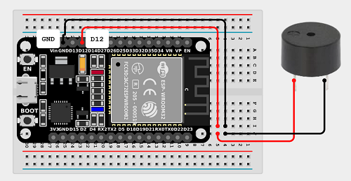

<p align="center">
	<a href="https://rtttl.skully.tech" target="_blank">
		<picture>
			
		</picture>
	</a>
</p>
<h1 align="center">
	RTTTL Web Composer
</h1>

<p align="center">
	
	
</p>
<p align="center">
	<a href="./LICENSE" alt="Project License"></a>
	
	<a href="https://rtttl.skully.tech" target="_blank"></a>
</p>

A rich web based composer for creating [Ring Tone Text Transfer Language (RTTTL)][1].

- 📝 Interactive, responsive, and user-friendly web interface for creating RTTTL ringtones
- 🎶 Dynamic RTTTL generation and browser playback using [Web Audio API](https://developer.mozilla.org/en-US/docs/Web/API/Web_Audio_API)
- 📦 Generate or import RTTTL ringtone strings

This tool was originally built with vanilla HTML, CSS & JS for the sake of simplicity, but eventually outgrew the basics and required a web framework to streamline development and better comply with modern standards. The application is built using the [Fresh](https://fresh.deno.dev) web framework with [Deno](https://deno.com) for the backend and build process. The frontend also uses the [Tabler](https://github.com/tabler/tabler) UI framework, [BS5](https://github.com/twbs/bootstrap), and [jQuery](https://jquery.com) for interactivity.

<div align="center" style="padding: 25px;">
	<h3><a href="https://rtttl.skully.tech" target="_blank" title="Open RTTTL Web Composer">Open Demo Application</a></h3>
	
</div>

---

## RTTTL
> [!NOTE]\
> For a more detailed description on RTTTL and its background history, specifications, and how it works, check out [*What is RTTTL?*](https://rtttl.skully.tech/rtttl_specification)

[RTTTL][1] *(Previously referred to as Nokring)* was originally developed in 1996 by Nokia for use in their mobile phones back when they were the dominant force in the mobile phone market and the most common method of composing, and sharing ringtones was through text messages. The format was simple and easy to understand which made its adoption quite popular though was quickly replaced by more modern formats such as [MIDI][2] and MP3 ringtones which offered more features and better sound quality.

The RTTTL format is still used today in some applications and devices such as hobbyist Arduino projects, IoT devices, and older mobile phones.

[1]: https://en.wikipedia.org/wiki/Ring_Tone_Text_Transfer_Language
[2]: https://en.wikipedia.org/wiki/MIDI

# Hardware
If you are interested in playing ringtones composed in RTTTL on physical hardware, or you may already possess the necessary electrical components to build a simple circuit, you can use the following example below as a starting reference for the basics.

Alternatively, if you prefer a ready-made hardware solution that comes ready to go out of the box then something like the [Apollo MSR-2](https://apolloautomation.com/products/msr-2) for Home Assistant is a great option for playing RTTTL. For more information on usage, refer to the [MSR-2 Buzzer](https://wiki.apolloautomation.com/products/msr2/examples/using-msr-2-buzzer/?h=rtt) documentation.

## Components
- **Microcontroller:** [ESP8266](https://amzn.to/4eaemqJ) / [ESP32](https://amzn.to/4eXCr5f), [Arduino Uno](https://amzn.to/4f6gAZw), or similar
- **Audio:** [Piezo Buzzer](https://amzn.to/3C9JfOM) or similiar *(3-5V, must be passive)*, or I2S Speaker
- **Wiring:** Jumper wires or breadboard

## Circuit Diagram
The following diagram is an example representation of a good basic circuit that connects a piezo buzzer to an ESP32 controller on a breadboard:

<p align="center">
	
</p>

Note that the actual circuit will vary depending on your controller:
- For ESP8266 boards, the software PWM output pins available are any in the range `GPIO0` - `GPIO16`
- For ESP32 boards, the [LEDC PWM channel](https://docs.espressif.com/projects/esp-idf/en/latest/esp32/api-reference/peripherals/ledc.html) can acts as output [*(diagram)*](https://docs.espressif.com/projects/esp-idf/en/latest/esp32/_images/ledc-api-settings.jpg) and you can normally use any pin in the range `GPIO0` - `GPIO33`

## Code
If your microcontroller is compatible with ESPHome then you can fortunately make use of the existing RTTTL component to easily play the RTTTL strings composed on the web application directly on the ESP device, see the [RTTTL Component](https://esphome.io/components/buzzer.html#rtttl-component) documentation for more information, the source for the underlying RTTTL library can be found [here](https://esphome.io/api/rtttl_8h).

```yaml
# Buzzer (ESP32 controller)
output:
  - platform: ledc
    pin: GPIO12
    id: buzzer
rtttl:
    output: buzzer

# Example API action
api:
  actions:
    - action: play_rtttl
      variables:
        song_str: string
      then:
        - rtttl.play:
            rtttl: !lambda 'return song_str;'
```

You can now invoke the `play_rtttl` action with `song_str` set to a valid RTTTL string such as:
```yaml
# Example RTTTL tone to play.
song_str: "James Bond:d=4, o=5, b=320:c, 8d, 8d, d, 2d, c, c, c, c, 8d#, 8d#, 2d#, d, d, d, c, 8d, 8d, d, 2d, c, c, c, c, 8d#, 8d#, d#, 2d#, d, c#, c, c6, 1b., g, f, 1g."
```

# License
This project is made available under the [GPL-2.0 License](./LICENSE).