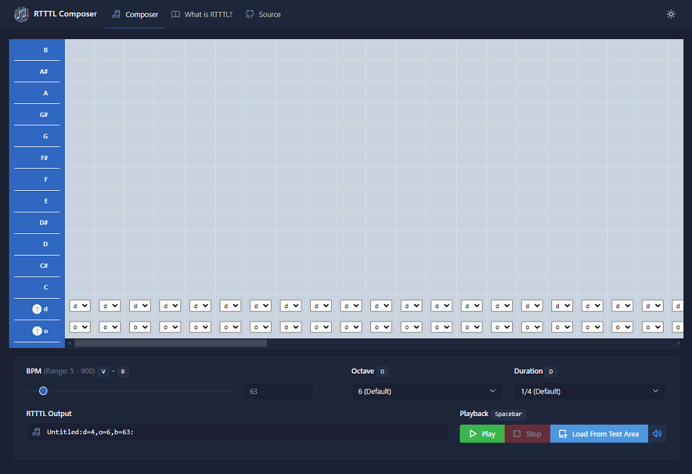

	
	<h2>RTTTL Web Composer</h2>

	
	
	
	

> [!NOTE]  
> This README requires expansion.

A rich web based composer for creating [Ring Tone Text Transfer Language (RTTTL)](https://en.wikipedia.org/wiki/Ring_Tone_Text_Transfer_Language) ringtones:

* 📝 Interactive, responsive, and user-friendly web interface for creating RTTTL ringtones
* 🎶 Dynamic RTTTL generation and browser playback using [Web Audio API](https://developer.mozilla.org/en-US/docs/Web/API/Web_Audio_API)
* 📦 Generate or import RTTTL ringtone strings

	<h3><a href="https://imskully.github.io/rtttl-web-composer" target="_blank" title="Open RTTTL Web Composer">Open Demo Application</a></h3>
	

This web application is built with barebones HTML & CSS, and vanilla JavaScript for the sake of simplicity. The frontend uses the [Tabler UI](https://github.com/tabler/tabler) framework, [BS5](https://github.com/twbs/bootstrap), and [jQuery](https://jquery.com) for UI components and interactivity.

***

## RTTTL

Ring Tone Text Transfer Language (RTTTL) is a simple text-based format for ringtones originally developed by Nokia in the 1990s. In simple terms, an RTTTL string represents a melody and timing information - the format is relatively easy to understand, making it popular for creating ringtones on early mobile phones.

In more modern usage, RTTTL is commonly found in Arduino/ESP8266/ESP32 projects that use a piezo buzzer for sound output.

	
<strong>RTTTL Format Specifications</strong>

	RTTTL (RingTone Text Transfer Language) is the primary format used to distribute 
	ringtones for Nokia phones. An RTTTL file is a text file, containing the 
	ringtone name, a control section and a section containing a comma separated 
	sequence of ring tone commands. White space must be ignored by any reader 
	application. 

	Example: 
	Simpsons:d=4,o=5,b=160:32p,c.6,e6,f#6,8a6,g.6,e6,c6,8a,8f#,8f#,8f#,2g

	This file describes a ringtone whose name is 'Simpsons'. The control section 
	sets the beats per minute at 160, the default note length as 4, and the default 
	scale as Octave 5. 
	<RTX file> := <name> ":" [<control section>] ":" <tone-commands>

		<name> := <char> ; maximum name length 10 characters

		<control-section> := <control-pair> ["," <control-section>]

			<control-pair> := <control-name> ["="] <control-value>

			<control-name> := "o" | "d" | "b"
			; Valid in control section: o=default scale, d=default duration, b=default beats per minute. 
			; if not specified, defaults are 4=duration, 6=scale, 63=beats-per-minute
			; any unknown control-names must be ignored

			<tone-commands> := <tone-command> ["," <tone-commands>]

			<tone-command> :=<note> | <control-pair>

			<note> := [<duration>] <note> [<scale>] [<special-duration>] <delimiter>

				<duration> := "1" | "2" | "4" | "8" | "16" | "32" 
				; duration is divider of full note duration, eg. 4 represents a quarter note

				<note> := "P" | "C" | "C#" | "D" | "D#" | "E" | "F" | "F#" | "G" | "G#" | "A" | "A#" | "B" 

				<scale> :="4" | "5" | "6" | "7"
				; Note that octave 4: A=440Hz, 5: A=880Hz, 6: A=1.76 kHz, 7: A=3.52 kHz
				; The lowest note on the Nokia 61xx is A4, the highest is B7

				<special-duration> := "." ; Dotted note

	; End of specification

